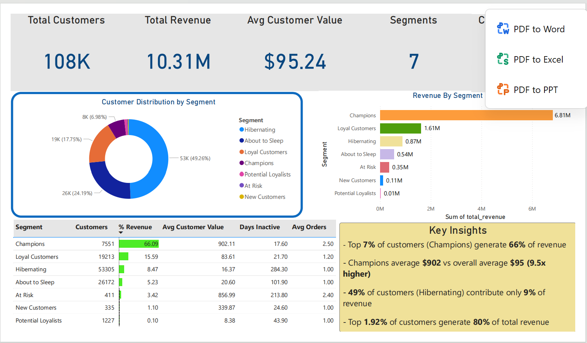
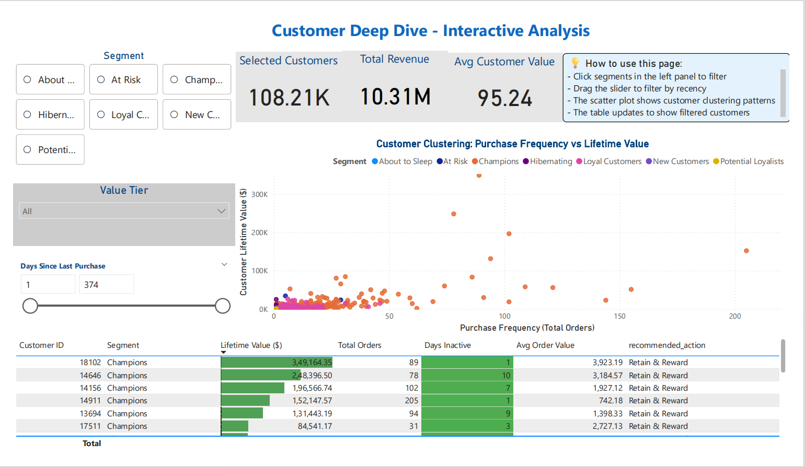

# Customer Segmentation \& RFM Analysis

An end-to-end **RFM (Recency, Frequency, Monetary)** customer-segmentation project on a UK online-retail dataset: clean the raw transactions in Python, score every customer, classify them into **10 behavioural segments**, then build a SQL analytics layer and an **interactive Power BI dashboard** that turns the segments into concrete retention actions.

> \*\*Stack:\*\* Python (pandas) · SQL (MySQL) · Power BI
> \*\*Data:\*\* \[Online Retail II](https://www.kaggle.com/datasets/lakshmi25npathi/online-retail-dataset) — UK gift retailer, \~1M invoice line-items · \*\*108K customers · $10.3M revenue\*\*
> \*\*Question:\*\* \*Who are our most valuable customers, who is slipping away, and where should retention effort go?\*

\---

## Dashboard

| Overview | Customer Deep Dive |
|---|---|
|  |  |


An interactive exploration page where a user can:

* **Filter by segment** (Champions, At Risk, Loyal, …) and by **value tier**, with KPI cards (selected customers, revenue, avg value) updating live.
* **Slide a recency filter** ("days since last purchase") to isolate lapsing customers.
* Read the **frequency-vs-lifetime-value scatter**, colour-coded by segment, which surfaces the customer-clustering pattern — a dense low-frequency base and a thin tail of high-value repeat buyers.
* Drill into a per-customer table showing lifetime value, order count, days inactive, and a **`recommended\_action`** (e.g. *Retain \& Reward* for Champions) — segmentation translated directly into what to do.

\---

## What it does

1. **Clean** — load the raw Excel transactions, handle missing customer IDs, drop returns/cancellations (negative quantity \& amount), compute line-item revenue.
2. **Score** — per customer, compute Recency (days since last purchase), Frequency (unique invoices), Monetary (total spend); assign 1-4 quartile scores on each dimension.
3. **Segment** — classify customers into 10 named segments from their R/F/M scores: **Champions, Loyal Customers, Potential Loyalists, New Customers, Promising, At Risk, Can't Lose Them, About to Sleep, Hibernating, Lost**.
4. **Act** — a SQL layer with segment-summary and action-priority views surfacing high-value **At-Risk** customers for targeted retention, plus revenue-concentration analysis across segments; the Power BI page makes it explorable.

\---

## Key ideas

* **Recency/Frequency/Monetary** captures value on three independent axes, so a big spender who has gone quiet (At Risk / Can't Lose Them) is handled differently from a frequent small spender.
* **Quartile scoring** self-calibrates to the dataset instead of relying on hard-coded thresholds.
* **The action layer is the point** — segmentation only matters if it changes what you do: the `recommended\_action` column and priority views rank exactly who to contact first.

\---

## Repo structure

```
RFM.ipynb            Python: clean -> RFM metrics -> quartile scoring -> 10-segment classification
rfm\_Query.sql        SQL: segment summary, Champions/At-Risk drill-downs, action-priority views
dashboard/
  Ecom\_Analytics.pbix   Power BI report (interactive Customer Deep Dive page)
  dashboard.png         page screenshot
```

\---

## Reproduce

1. Download the [Online Retail II dataset](https://www.kaggle.com/datasets/lakshmi25npathi/online-retail-dataset) (`online\_retail\_II.xlsx`).
2. Run `RFM.ipynb` to clean the data and produce `rfm\_analysis\_clean.csv`.
3. Load that CSV into MySQL and run `rfm\_Query.sql` for the segment analysis and action views.
4. Open the Power BI report on top of the results.

\---

## Notes on data handling

* **Dates:** the source data is from 2009-2011; invoice dates are rebased forward in the notebook so recency reads on a recent scale for demo purposes — the *relative* recency between customers is unchanged.
* **Missing customer IDs:** anonymous transactions are assigned synthetic IDs rather than dropped, so their revenue still counts in segment totals.
* **Returns/cancellations:** rows with non-positive quantity or amount are removed before scoring.

